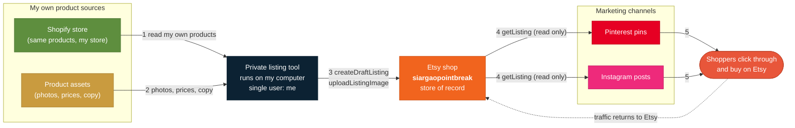
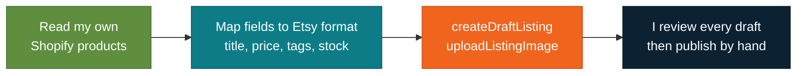
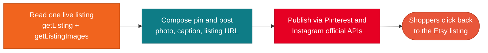

# Siargao Point Break: Etsy API Access Request

-C99B3F?style=for-the-badge)

**Live visual version of this request:** https://riochen2011.github.io/siargaopointbreak-etsy-api-request/

**The shop:** [siargaopointbreak.etsy.com](https://siargaopointbreak.etsy.com), a single owner Etsy shop in the Philippines selling ocean inspired beaded jewelry (first line: sharktooth necklaces).

This repository documents **why** the shop is requesting Etsy Open API v3 access. It is a private, personal seller tool with exactly one user: the shop owner. It does three things: moves the owner's own Shopify listings onto Etsy, automates listing drafts with a human review step, and turns live Etsy listings into Pinterest pins and Instagram posts that link shoppers back to Etsy.

---

## The whole picture

Everything runs on the owner's computer against the owner's own accounts. Etsy stays the store of record: listings, prices, stock, and orders all live on Etsy.

---

## Use case 1: move my Shopify listings onto Etsy

I already sell the same handmade pieces on my own Shopify store. Instead of retyping every product into Etsy by hand, the tool copies my own records across and prepares Etsy **drafts**.

## Use case 2: automate new listings and keep them in sync

New pieces start as photos and notes on my computer. The tool turns prepared assets into drafts, and keeps price and quantity on Etsy matching my records. Nothing is ever published automatically.

## Use case 3: turn listings into Pinterest pins and Instagram posts

Marketing **reads** Etsy, it never writes. The tool pulls one live listing and builds a pin and a post around it. Every piece of content links straight back to that Etsy listing, so the traffic lands on Etsy.

---

## Exactly what is requested

### OAuth scopes

| Scope | Type | Why |
|---|---|---|
| `listings_r` | read | Read my listings so sync and marketing match what is live on Etsy |
| `listings_w` | write | Create draft listings, upload images, update price and stock |
| `shops_r` | read | Read my own shop profile to confirm the tool points at the right shop |

**Not requested:** transactions, billing, address, cart, favorites, feedback, or any scope that touches buyers or other sellers.

### Endpoints the tool calls

| Endpoint | Purpose | Use case |
|---|---|---|
| `getShop` | Confirm shop identity at startup | 1, 2, 3 |
| `getListingsByShop` | List my listings for sync and content planning | 2, 3 |
| `createDraftListing` | Create a draft, never a live listing | 1, 2 |
| `uploadListingImage` | Attach my product photos to a draft | 1, 2 |
| `updateListing` | Apply corrections I approve | 2 |
| `updateListingInventory` | Keep price and quantity matching my records | 2 |
| `getListing` | Read one listing to build a pin or post | 3 |
| `getListingImages` | Fetch the listing photo for that pin or post | 3 |

### How it behaves

- **Low volume.** A short batch run when I add products and a small daily sync. Dozens of calls a day, far under default rate limits.
- **OAuth 2.0 with PKCE.** Tokens are stored in a local file on my computer, never committed, never shared.
- **Backoff built in.** The tool respects rate limit headers and retries with exponential backoff.
- **Nothing auto publishes.** The API writes drafts and sync updates. Publishing is always a manual decision.

---

## Responsible use

| It does | It never does |
|---|---|
| Works only on siargaopointbreak, a shop I own | No scraping or crawling of Etsy pages or other shops |
| Creates drafts for my review | No access to buyer data, other sellers, or marketplace analytics |
| Keeps Etsy price and stock accurate | No resale or sharing of Etsy data with any third party |
| Sends social shoppers to Etsy | No automated reviews, messages, or purchases |
| Follows the Etsy API Terms of Use | No public distribution, no other users, keys stay private |

---

The term "Etsy" is a trademark of Etsy, Inc. This application uses the Etsy API but is not endorsed or certified by Etsy, Inc. Shopify, Pinterest, and Instagram are trademarks of their respective owners, mentioned here only to describe the workflow.
